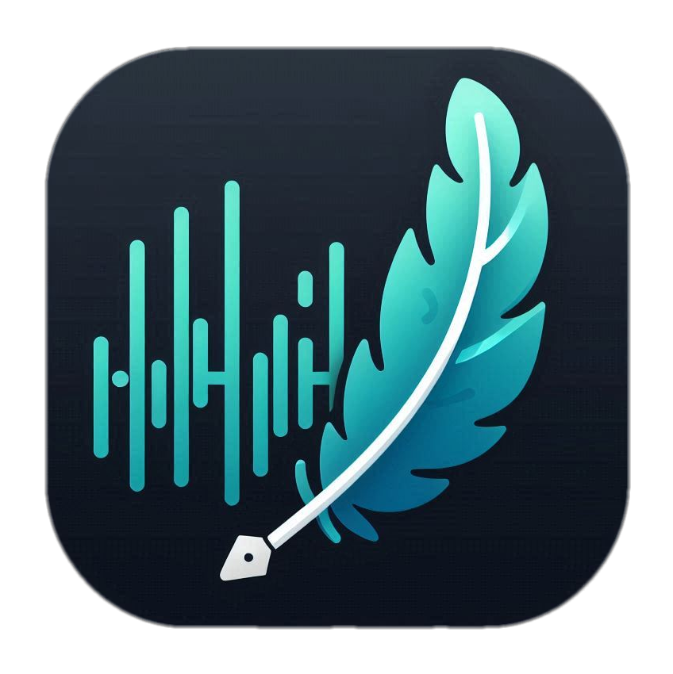

  

<h1 align="center">Whisperer - Transcribe on your own!</h1>

# Privacy Policy 🔒

Your privacy is important to us. Whisperer is designed with privacy as a core principle - all transcription happens completely offline on your device, and no data ever leaves your machine.

# Credits

Thanks for [tauri.app](https://tauri.app/) for making the best apps framework I ever seen

Thanks for [wang-bin/avbuild](https://github.com/wang-bin/avbuild) for pre built `ffmpeg`

Thanks for [github.com/whisper.cpp](https://github.com/ggerganov/whisper.cpp) for outstanding interface for the AI model.

Thanks for [openai.com](https://openai.com/) for their amazing [Whisper model](https://openai.com/research/whisper)

Thanks for [github.com](https://github.com/) for their support in open source projects, providing infastructure completely free.

And for all the amazing open source frameworks and libraries which this project uses...